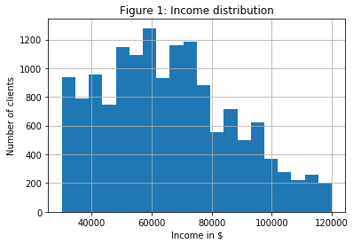
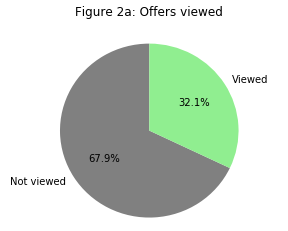
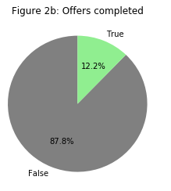
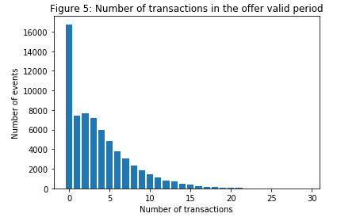
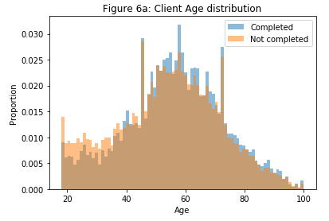

# Starbucks Capstone Challenge

This challenge is the final capstone project for the Udacity Data Science Nanodegree Program. 

The Structure of the project is the following:

- [Starbucks Capstone Challenge](#starbucks-capstone-challenge)
  - [1. Introduction](#1-introduction)
    - [1.1 Overview](#11-overview)
    - [1.2 The Data](#12-the-data)
    - [1.3 Problem Statement](#13-problem-statement)
    - [1.4 Requeriments & Files Information](#14-requeriments--files-information)
  - [2. Pre-processing](#2-pre-processing)
  - [3. Data Exploration and Visualizations](#3-data-exploration-and-visualizations)
  - [4. Modeling](#4-modeling)
    - [4.1 Model preparation](#41-model-preparation)
    - [4.2 Training and Predictions](#42-training-and-predictions)
  - [5. Results & Conclusions](#5-results--conclusions)
  - [6. Next Steps](#6-next-steps)

## 1. Introduction

### 1.1 Overview

The aim of this project is to conduct a complete data science pipeline from real raw data provided by Starbucks. 

You can follow all the code and a more detailed explanation of the process in the included Python Notebook or in this [Medium article](https://www.medium.com).

### 1.2 The Data

The provided data consits of three different json files with the following information:

**portfolio.json**: Information about the different offers sent to clients.
- id (string) - offer id
- offer_type (string) - type of offer ie BOGO, discount, informational
- difficulty (int) - minimum required spend to complete an offer
- reward (int) - reward given for completing an offer
- duration (int) - time for offer to be open, in days
- channels (list of strings)

**profile.json**: Information about the different clients.
- age (int) - age of the customer
- became_member_on (int) - date when customer created an app account
- gender (str) - gender of the customer (note some entries contain 'O' for other rather than M or F)
- id (str) - customer id
- income (float) - customer's income

**transcript.json**: Interactions of clients with Starbucks.
- event (str) - record description (ie transaction, offer received, offer viewed, etc.)
- person (str) - customer id
- time (int) - time in hours since start of test. The data begins at time t=0
- value - (dict of strings) - either an offer id or transaction amount depending on the record

### 1.3 Problem Statement 

The objective is to analyze the different offers and try to explain how effective they are for increasing the number/amount of transactions with Starbucks. 
Finally, we will try to predict for a specific user and offer if the transactions will increase or be completed.

### 1.4 Requeriments & Files Information

**Requeriments:**

- Python
- Numpy
- json
- Pandas
- Matplotlib
- Sklearn

**Files:**

- Starbucks_Capstone_notebook.ipynb: Python Notebook with all the code
- Visualizations: Folder with all presented images
- df_offers.csv: The pre-processing of the dataframe df_offers takes a lot of time. You can load directly the preprocessed dataframe if you wish.

## 2. Pre-processing

Before we begin to extract conclusions, we have to rearrange the data so we can know if a client has actually seen the offer within the offer duration period to know if
the offer could have any impact in the client behaviour.

In this section also basic cleaning activities were performed.

## 3. Data Exploration and Visualizations

- We have a dataset with 17000 different clients, but for 2175 there is no personal data (Gender, Age and Income).
57% of all clients are men and 41% women. The mean age is 54.39 years (no data for <18 years clients) and the mean income salary is 65404$/year with the following distribution:

- There are 10 different types of offer. The offers differ in the offer type (Bogo, discount or informational), duration, difficulty and reward.

- The transcripts have four different event types: (Offer received, Offer viewed, offer completed and transactions (client buying a product))

Most of the events are transactions:

| Event           | Number |
| --------------- | ------ |
| transaction     | 138953 |
| offer received  | 76277  |
| offer viewed    | 57725  |
| offer completed | 33579  |

Only 32% of all the offers sent are viewed. The offers completed are the 12%:

 

In the following image we can also see that the informational offers are the less viewed:

We can see the proportion of offers completed depending of they are previously viewed by the client or not:

The offers viewed are much easier to be completed (logically). Only a few of the non viewed offers are completed.

In the following image we can see how many transactions are made after an offer is sent during the active period of the offer:

And for the total amount spent:

Finally, let's see how the age and the income affect if an offer is completed or not.

**Age:**

Completed Offers mean age: 56.25 years
Not completed offers mean age: 54.10 years
Age distribution:

**Income:**

Completed Offers mean income: 70314.4$ 
Not completed offers mean income: 64684.14 $
Income distribution:

The age is probably correlated with the income and a higher income defines a higher completition rate.

## 4. Modeling

### 4.1 Model preparation

First, we generate a dataframe with all relevant features.
In this section we also convert all categorical variables to one hot enconding and string True/False variables to Integers so the model can work with them. We drop also the 5 rows with NaN values.
Split data into train and test sets.

### 4.2 Training and Predictions

Training Models & Generating predictions - See Jupyter Notebook

## 5. Results & Conclusions

**Analysis**

* Offers viewed by users have a direct impact in the amount of transactions spent.
* It is difficult to see major differences between ages for the completition rate. Income is probably the reason here.

**Predictions results:**

| Model                | Accuracy | f1-score |
| -------------------- | -------- | -------- |
| Gaussian Naive Bayes | 85.59%   | 35.03%   |
| MLP                  | 87.16%   | 3.76%    |
| K-Neighbours         | 86.40%   | 10.72%   |
| Random Forest*       | 87.68%   | 0.0%     |

*The accuracy if we predict always not completed will be 87.68%. Random Forest is just doing that (f1-score of 0%)

We can see that altough the accuracy is above 80%, it doesn't mean its a good accuracy because if we predict only a offer as not completed, we would achieve an accuracy of 87%. We can see that in the low f1-scores. Looking at the actual metrics I would continue with the Naive Bayes model.

## 6. Next Steps

**Analysis:**
* More in depth relationship analisys (e.g: relation of completition rate with client data and offer type)
* Comparation of number/amount spent of transactions after an offer is viewed

**Predictions:**
* Feature engineering and use more features to optimize metrics
* Hyperparameter Tuning to optimize metrics

